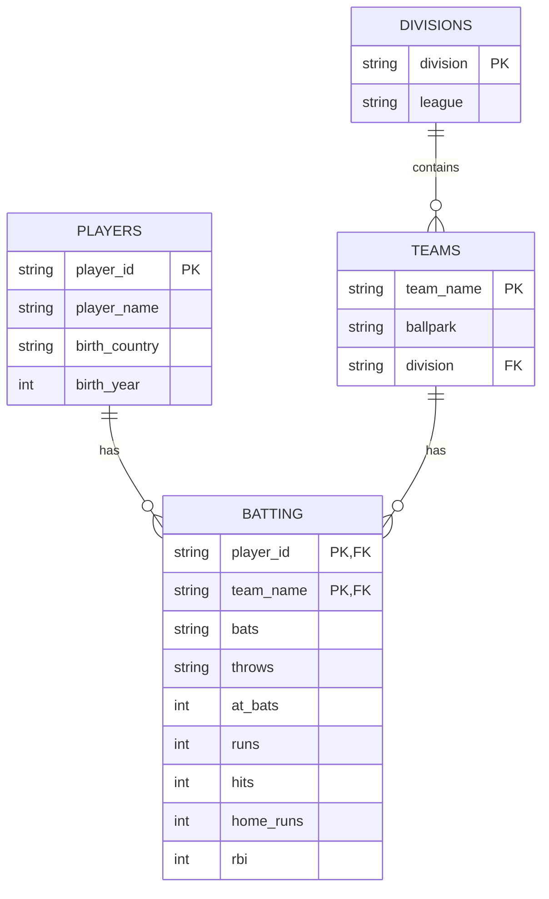

```mermaid
erDiagram
    DIVISIONS {
        string division PK
        string league
    }

    TEAMS {
        string team_name PK
        string ballpark
        string division FK
    }

    PLAYERS {
        string player_id PK
        string player_name
        string birth_country
        int birth_year
    }

    BATTING {
        string player_id PK, FK
        string team_name PK, FK
        string bats
        string throws
        int at_bats
        int runs
        int hits
        int home_runs
        int rbi
    }

    DIVISIONS ||--o{ TEAMS : "contains"
    PLAYERS ||--o{ BATTING : "has"
    TEAMS ||--o{ BATTING : "has"
```